# FunRoute — Functional Flow Diagrams

> Diagram alur per fitur. Dibaca dari atas ke bawah.  
> Render otomatis di GitHub, VS Code (Mermaid extension), dan GitLab.

---

## 1. Onboarding & Auth

```mermaid
flowchart TD
    A([App dibuka]) --> B[_layout.tsx: init auth\nsupabase.auth.getSession]

    B --> C{Session ada?}

    C -- Ya --> D[Redirect ke app/index]
    C -- Tidak --> E[Redirect ke auth/login]

    D --> F{Izin GPS\nsudah granted?}
    F -- Ya --> G([Home Screen])
    F -- Tidak --> H[Redirect ke /permission]

    E --> I[Layar Login / Daftar]
    I --> J{User pilih}
    J --> K[Login dengan email]
    J --> L[Daftar akun baru]
    J --> M[Lewati / Mode Tamu]

    K --> N[supabase.auth.signInWithPassword]
    L --> O[supabase.auth.signUp]
    N & O --> P{Berhasil?}
    P -- Ya --> H
    P -- Gagal --> Q[Tampilkan error]
    Q --> I

    M --> H
```

---

## 2. Permintaan Izin GPS

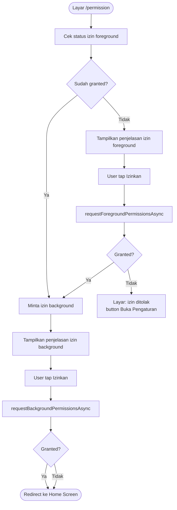

---

## 3. Generate Rute (Client-Side OSRM)

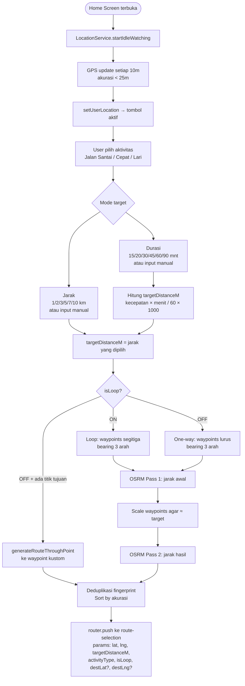

---

## 4. Pilih Titik Tujuan (Opsional)

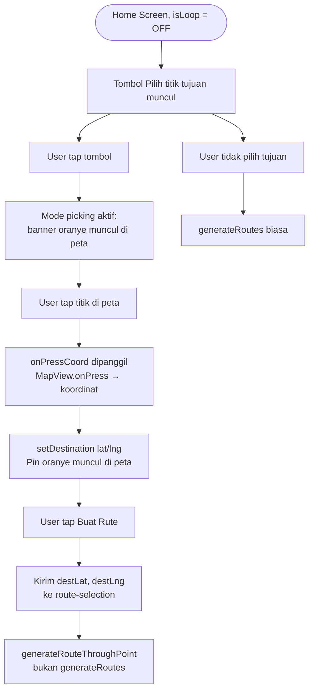

---

## 5. Pemilihan Rute & Mulai Navigasi

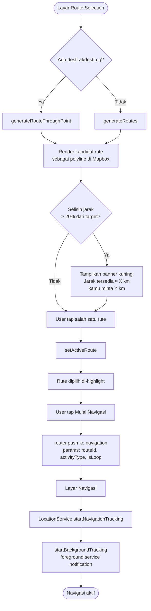

---

## 6. Navigasi Real-Time & GPS Tracking

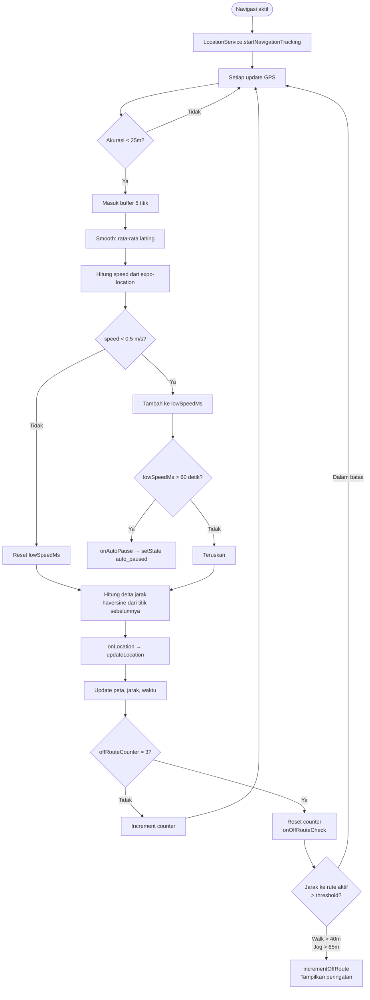

---

## 7. Loop Arrival Detection

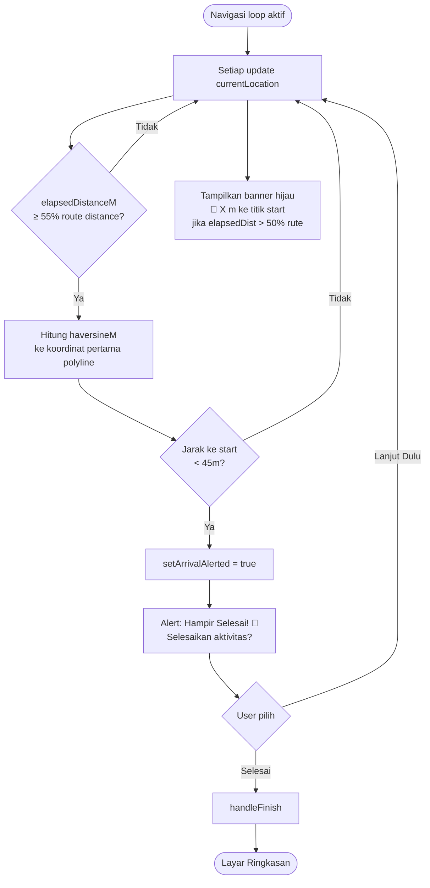

---

## 8. Background Tracking (App Diminimize)

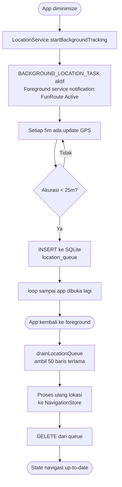

---

## 9. Auto-Pause & Resume

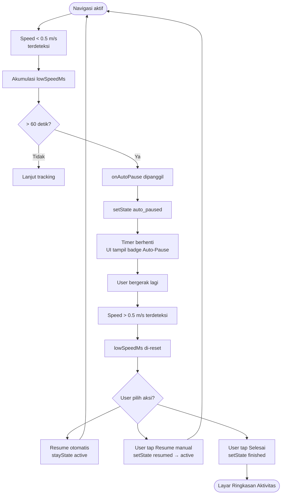

---

## 10. Tandai Lokasi (POI & Avoidance)

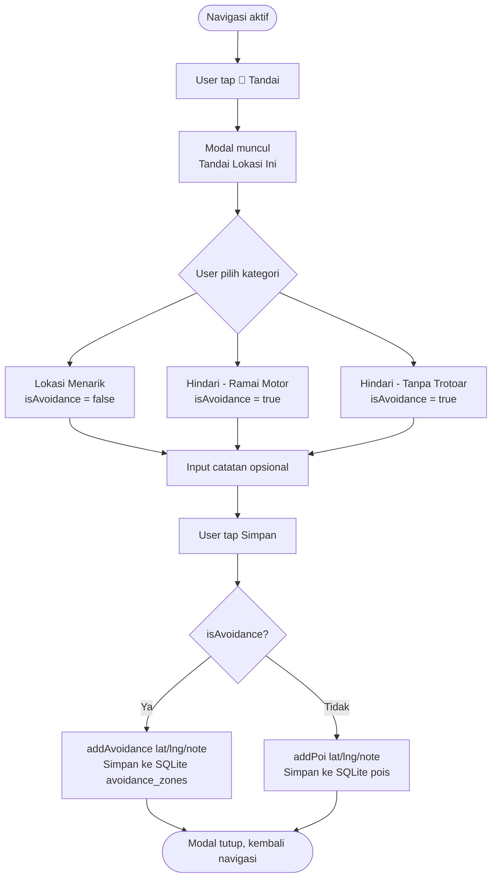

---

## 11. Selesai Aktivitas & Simpan

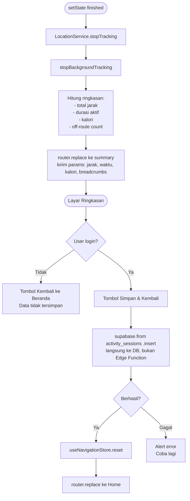
